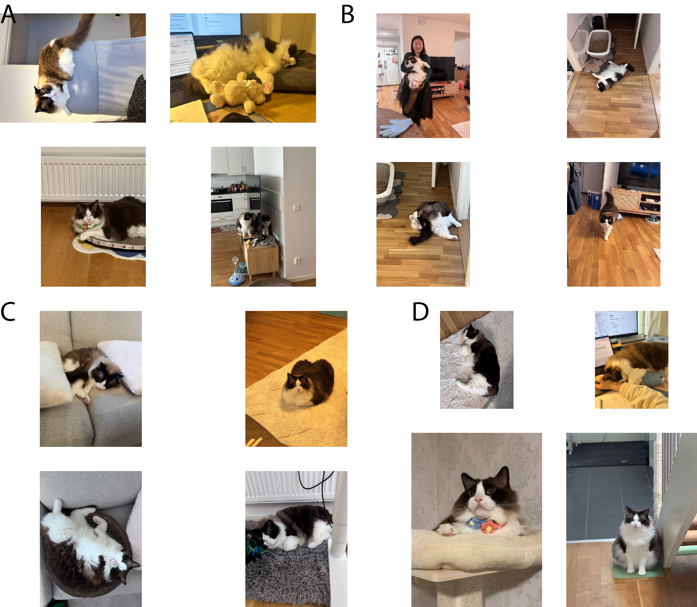

# PanelJet

`PanelJet` is a macOS-first tool for accelerating scientific figure assembly. It scans a folder of figure files, builds an Adobe Illustrator JSX layout script, and can optionally ask Illustrator to create an editable `.ai` document for you.

It is designed for workflows where you want:

- automatic panel packing from a folder of `pdf/png/jpg/tiff`
- both simple flat panel layouts and grouped composite figure layouts
- `A/B/C/...` panel labels
- shape-aware ordering for standard, tall, and wide figures
- a real Illustrator document you can still tweak by hand
- a natural-language wrapper for Codex and Claude Code

## Platform support

Current workflow targets:

- macOS
- Adobe Illustrator installed locally
- `sips` available on the system

Currently macOS-focused; cross-platform support would require replacing `sips` and AppleScript integration.

## Requirements

- Python 3.10 or newer
- macOS
- Adobe Illustrator installed locally
- `sips` available on the system

## Install

### From a local checkout

```bash
pip install -e .
```

### From GitHub

```bash
pip install git+https://github.com/alexpengyl1/paneljet.git
```

## Quick start

Auto-detect figure sizes, use smart ordering and smart layout, generate JSX, and open Illustrator:

```bash
paneljet \
  /path/to/figure_folder \
  --order-mode smart \
  --layout-mode smart \
  --name Figure3_layout \
  --ai-width-mm 180 \
  --auto-height \
  --run-illustrator
```

This writes:

- `/path/to/figure_folder/Figure3_layout.jsx`
- `/path/to/figure_folder/Figure3_layout.ai`

## Demo


The demo collage above uses the author's two very fluffy ragdoll cats as sample data: Heli (male, 9.5 kg) and Huajuan (female, 4.5 kg).

## Layout modes

PanelJet now supports two complementary layout modes:

- `Basic layout`: all input files are treated as one flat list of panels, then packed into rows such as `3,3,3` or `2,2,1`
- `Composite layout`: panels are first grouped into blocks such as `A`, `B`, and `C`; each group gets its own internal layout, then the groups are packed into an outer layout such as `A,B ; C`

Use basic layout for most standard manuscript figures. Use composite layout when a figure contains sub-figures that should stay together.

## Basic layout

For many SCI-style journal figures, a practical default is `180 mm` width for a double-column figure. As a reference point, Nature’s figure guide uses `89 mm` for single-column and `183 mm` for double-column figures.

Practical width guide:

- `89-90 mm`: single-column figure
- `120-136 mm`: intermediate or 1.5-column figure
- `180-183 mm`: double-column figure

In practice:

- use fixed width plus fixed height when you already know the exact target figure box
- use fixed width plus `--auto-height` when you want panel widths to stay consistent but do not want large blank space above and below the packed figure

### 1. Auto-scan a folder and preview layout

```bash
paneljet \
  /path/to/figure_folder \
  --order-mode smart \
  --layout-mode smart \
  --dry-run
```

### 2. Use explicit order and labels

```bash
paneljet \
  /path/to/figure_folder \
  --files "A=plot1.pdf,B=plot2.pdf,C=plot3.pdf,D=plot4.pdf" \
  --layout 2,2 \
  --name Figure2_layout \
  --ai-width-mm 240 --ai-height-mm 160 \
  --run-illustrator
```

### 3. Keep width fixed and shrink extra vertical whitespace

This is useful for manuscript figures where panel widths should stay consistent, but the artboard should not keep large top and bottom blank areas.

```bash
paneljet \
  /path/to/figure_folder \
  --order-mode smart \
  --layout-mode smart \
  --ai-width-mm 180 \
  --auto-height \
  --run-illustrator
```

### 4. Use a text file for order

Create `order.txt`:

```text
A=plot1.pdf
B=plot2.pdf
C=plot3.pdf
D=plot4.pdf
```

Then run:

```bash
paneljet \
  /path/to/figure_folder \
  --files-file /path/to/order.txt \
  --layout 2,2 \
  --name Figure2_layout
```

## Composite layout

Composite layout is meant for figures that have meaningful grouped sub-figures.

Example target structure:

- group `A`: 4 files laid out as `2,2`
- group `B`: 1 file laid out as `1`
- group `C`: 9 files laid out as `3,3,3`
- outer layout: first row `A,B`, second row `C`

In this mode:

- each group keeps its own internal layout
- groups in the same outer row are scaled to the same visual height
- the overall figure can still use `--ai-width-mm` and `--auto-height`
- the original basic layout mode still works unchanged
- group member filenames such as `A1`, `A2`, `C7` are only used for configuration; the rendered figure shows one label per group such as `A`, `B`, and `C`

Create a layout file such as `composite_layout.txt`:

```text
[group A]
files = A1.png,A2.png,A3.png,A4.png
layout = 2,2

[group B]
files = B1.png
layout = 1

[group C]
files = C1.png,C2.png,C3.png,C4.png,C5.png,C6.png,C7.png,C8.png,C9.png
layout = 3,3,3

[figure]
rows = A,B ; C
```

Then run:

```bash
paneljet \
  /path/to/figure_folder \
  --group-layout-file /path/to/composite_layout.txt \
  --ai-width-mm 180 \
  --auto-height \
  --run-illustrator
```

Notes for composite layout:

- all files referenced by `--group-layout-file` are resolved relative to the input folder
- every group listed in the file must appear exactly once in `[figure] rows = ...`
- `rows = A,B ; C` means first row `A` and `B`, second row `C`
- groups in the same row are equal-height blocks; their widths are distributed automatically from their internal layout geometry
- group labels are drawn once per group at the top-left of each block; inner panels inside the group do not receive separate letter labels
- inside each group, images are read individually and their aspect ratios are used during layout
- panels in the same inner row are scaled to the same height, while widths vary automatically from the image aspect ratios
- this keeps grouped layouts tighter and reduces unnecessary blank space inside a `2,2` or `3,3,3` block

### Composite example: 16 images as four grouped sub-figures

One practical pattern is a figure built from 16 images arranged as four grouped sub-figures:

- outer layout: `A,B ; C,D`
- inner layout for every group: `2,2`
- rendered labels: only `A`, `B`, `C`, and `D`
- filenames such as `A1`, `A2`, `B3`, `D4` are only used for configuration

Example layout file:

```text
[group A]
files = A1.jpg,A2.jpg,A3.jpg,A4.jpg
layout = 2,2

[group B]
files = B1.jpg,B2.jpg,B3.jpg,B4.jpg
layout = 2,2

[group C]
files = C1.jpg,C2.jpg,C3.jpg,C4.jpg
layout = 2,2

[group D]
files = D1.jpg,D2.jpg,D3.jpg,D4.jpg
layout = 2,2

[figure]
rows = A,B ; C,D
```

Run it like this:

```bash
paneljet \
  /path/to/cat16_assets \
  --group-layout-file /path/to/cat16_assets/composite_layout.txt \
  --ai-width-mm 180 \
  --auto-height \
  --run-illustrator
```

What PanelJet does in this case:

- unsupported files such as `HEIC` should first be converted to a supported input format such as `jpg`
- every image in `A1` through `D4` is measured individually
- within each group row, the images are resized so that the row height is consistent
- within that row, image widths are adjusted automatically from each image's aspect ratio
- this makes the grouped block visually tighter than forcing every small panel to share the same width

Example output:



## Natural language with Codex and Claude Code

This repository includes both:

- a Codex skill at [`.codex/skills/paneljet`](./.codex/skills/paneljet)
- a Claude Code skill at [`.claude/skills/paneljet`](./.claude/skills/paneljet)

That means the same core tool can be used in three ways:

- direct CLI: `paneljet ...`
- Codex natural language wrapper
- Claude Code natural language wrapper

Example natural-language intents:

- "Pack this folder into an Illustrator figure and make it 180 mm wide with auto height."
- "Treat A as a 2 by 2 block, B as a single panel, C as a 3 by 3 block, and place A and B above C."
- "Arrange these files as A-H and open Illustrator."
- "Preview the smart layout before generating the AI file."

## CLI reference

### Inputs

- `folder`: folder containing figure files
- `--files`: comma-separated explicit order, supports `A=file.pdf,B=file2.pdf`
- `--files-file`: text file with one filename or `label=filename` per line
- `--group-layout-file`: grouped composite layout file with `[group NAME]` sections and `[figure] rows = ...`

### Ordering and layout

- `--order-mode natural|smart`
- `--layout-mode balanced|smart`
- `--layout 3,3,2`

### Output naming

- `--name Figure3_layout`
- `--output-jsx /path/to/file.jsx`
- `--save-ai /path/to/file.ai`

### Artboard sizing

- `--artboard-size A4|A3|letter|WxH`
- `--landscape`
- `--ai-width-mm 260 --ai-height-mm 180`
- `--ai-width-mm 180 --auto-height`

Recommended journal-style defaults:

- single-column: `--ai-width-mm 89 --auto-height`
- double-column: `--ai-width-mm 180 --auto-height`

`--auto-height` keeps the chosen artboard width and automatically shrinks the artboard height to fit the packed panels with more appropriate top and bottom whitespace.

If you already know the exact final figure box required by a journal, use both `--ai-width-mm` and `--ai-height-mm` instead of `--auto-height`.

### Labels and spacing

- `--no-labels`
- `--label-size 18`
- `--margin 24`
- `--gap 16`

### Execution

- `--dry-run`
- `--run-illustrator`
- `--auto-height`
- `--illustrator-app NAME`

Usually you can just use `--run-illustrator` and let PanelJet detect the AppleScript app name automatically.

If you need to set it manually, use one app name such as:
`--illustrator-app "Illustrator"`

## How it works

1. Scans the folder for supported input figures.
2. Uses `sips` to read width and height.
3. Classifies each figure as `standard`, `tall`, or `wide`.
4. Builds a row layout.
5. Writes an Illustrator JSX script that:
   - creates a new document
   - places each figure
   - scales proportionally
   - centers inside its cell
   - adds labels
   - optionally saves to `.ai`
6. Optionally tells Illustrator to run that JSX.

## Limitations

- currently macOS-focused
- depends on Illustrator scripting being enabled by the local system permissions
- AppleScript app naming can vary by local Illustrator install, so explicit `--illustrator-app` is still available as an override
- current smart layout is heuristic, not a full optimization engine

## Development

Run locally without installing:

```bash
python -m paneljet.cli /path/to/figure_folder --dry-run
```

Or install editable:

```bash
pip install -e .
```

## About the author

PanelJet is created by Yueling Peng, a postdoctoral researcher at the University of Gothenburg with research experience spanning multi-omics, single-cell and spatial transcriptomics, machine learning, and translational immunology.

The tool was developed to speed up scientific figure assembly for manuscript and presentation workflows while keeping Adobe Illustrator output fully editable.

- GitHub: [alexpengyl1](https://github.com/alexpengyl1)
- Email: yueling.peng@gu.se

## License

MIT
